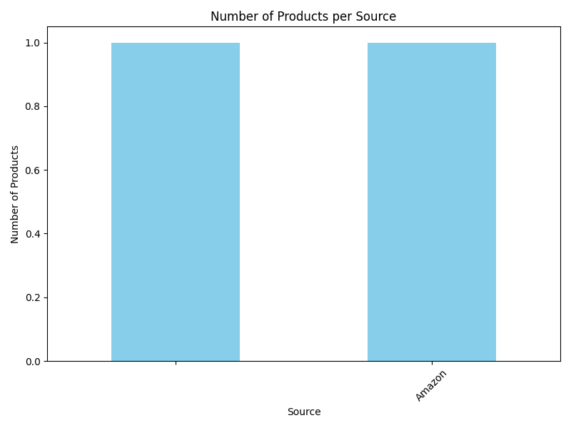
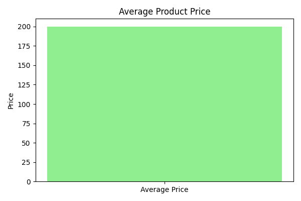

---

# 📊 ProductPulse – End‑to‑End Data Pipeline

## Highlights for Recruiters
**End‑to‑End Data Pipeline**: Demonstrates the full workflow — collection, cleaning, analysis, visualization, and reporting.

** Modular & Professional Design**: Clear folder structure and well‑documented code, mirroring real industry practices.

**Practical Outputs**: Generates clean datasets, insightful charts, and polished Excel/CSV reports recruiters can instantly understand.

**Technical Proficiency**: Showcases skills in Python, BeautifulSoup, Pandas, Matplotlib, and reporting tools.

## 🚀 Overview
**ProductPulse** is a modular, end‑to‑end data pipeline built in Python that transforms raw product data into clean insights, visualizations, and professional reports.  
It demonstrates mastery of the complete data workflow — **collection → cleaning → analysis → visualization → reporting** — with a clear, maintainable structure that mirrors real‑world data engineering and analytics practices.

---

## 🎯 Purpose
This project was created to:
- Showcase a **portfolio‑ready data pipeline** with professional modular design.  
- Demonstrate proficiency in **web scraping, data cleaning, analysis, visualization, and reporting**.  
- Provide recruiters and collaborators with a clear view of your technical and organizational skills.  

---

## 🗂 Project Structure

```
ProductPulse/
│
├── Data Analysis/
│   └── analyzer.py                  # Phase 3: Data analysis logic
│
├── Data Cleaning/
│   └── cleaner.py                   # Phase 2: Data cleaning and preprocessing
│
├── Data Collection/
│   ├── collector.py                 # Phase 1: Web scraping and data collection
│   ├── config.py                    # Configuration settings
│   ├── parsers.py                   # HTML parsing utilities
│   ├── storage.py                   # Data storage and handling
│   └── utils.py                     # Helper functions
│
├── Data Reporter/
│   └── report_generator.py          # Phase 5: Report generation (Excel/CSV)
│
├── Data/
│   ├── Analysis/
│   │   ├── analysis_results.csv
│   │   └── analysis_results.xlsx
│   ├── Cleaned/
│   │   ├── cleaned_product.json
│   │   └── debug.json
│   ├── Processed/
│   │   └── product_2026-07-15T16_35_36Z.json
│   ├── Raw/
│   │   ├── 2026-07-15T16_35_33Z.json
│   │   └── 2026-07-15T16_35_36Z.json
│   ├── Report/
│   │   ├── report.csv
│   │   └── report.xlsx
│   └── Visualizations/
│       ├── average_price.png
│       └── products_per_source.png
│
├── Tests/
│   ├── test_analyzer.py
│   ├── test_cleaner.py
│   ├── test_main.py
│   └── test_storage.py
│
├── Visualization/
│   └── visualizer.py                # Phase 4: Visualization generation
│
├── data_cleaning/
│   └── cleaner.py                   # Duplicate module reference for organization
│
├── LICENSE
├── README.md
├── main.py                          # Entry point for running all phases
└── requirements.txt                 # Dependencies list
```

---

## 🔑 Phase Breakdown

### **Phase 1 – Data Collection**
- **Goal:** Scrape raw product data using BeautifulSoup.  
- **Output:** Structured JSON files stored in `Data/Raw/`.

### **Phase 2 – Data Cleaning**
- **Goal:** Clean and preprocess raw data for consistency and accuracy.  
- **Output:** Cleaned JSON files stored in `Data/Cleaned/`.

### **Phase 3 – Data Analysis**
- **Goal:** Perform exploratory data analysis (EDA) using Pandas.  
- **Output:** Analytical results saved in CSV and Excel formats under `Data/Analysis/`.

### **Phase 4 – Data Visualization**
- **Goal:** Create clear, professional charts using Matplotlib.  
- **Output:** Visualizations saved in `Data/Visualizations/`.

#### Example Visualization Output:
The analysis results are visualized using Matplotlib.  
Below is an example output showing product distribution across sources:



Another example showing average product prices:




This chart illustrates product distribution across different sources, providing a quick visual summary of data coverage.

### **Phase 5 – Reporting**
- **Goal:** Generate final reports in Excel and CSV formats for presentation.  
- **Output:** Reports stored in `Data/Report/`.

### **Future Improvements**
- **Phase 6**: Deploy reports via dashboard”) to show forward‑thinking.

---

## 🛠 Tech Stack
- **Python** – Core language  
- **Beautifulsoup** – Web scraping  
- **Pandas** – Data manipulation and analysis  
- **Matplotlib** – Visualization  
- **OpenPyXL** – Excel report generation  

---

## ⚙️ How to Run
1. Clone the repository:
   ```bash
   git clone https://github.com/vihan1207/ProductPulse.git
   cd ProductPulse
   ```
2. Install dependencies:
   ```bash
   pip install -r requirements.txt
   ```
3. Run the pipeline:
   ```bash
   python main.py
   ```

---
